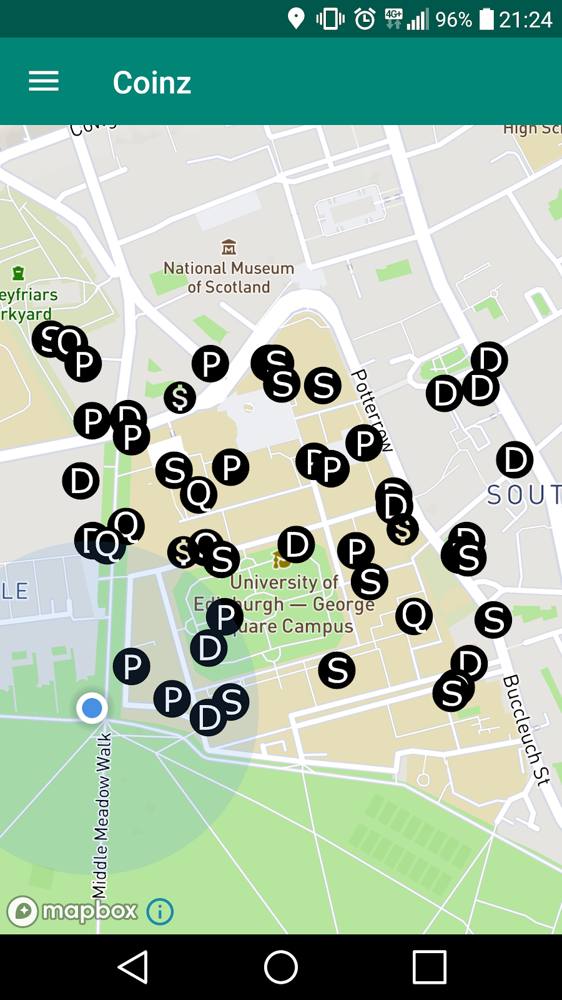
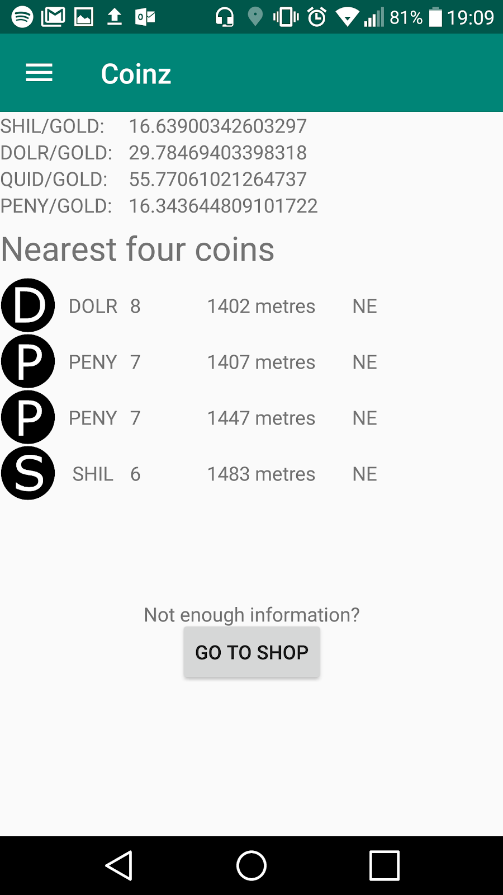
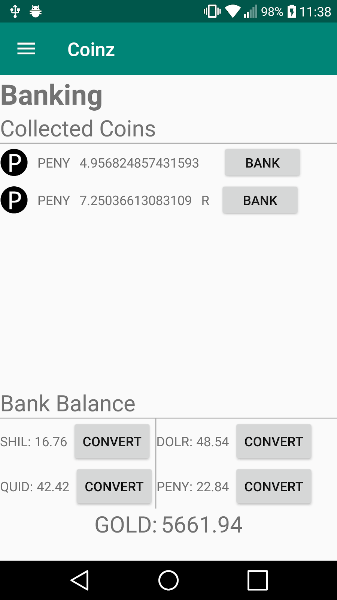
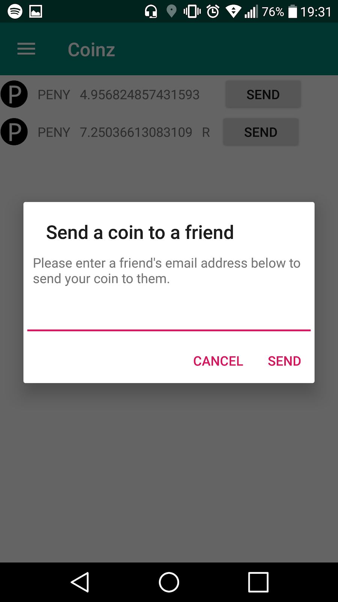

Coinz - Informatics Large Practical 2018
==================

This repository contains an Android app built for the Informatics Large Practical course during the third year of The University of Edinburgh. The app is a game where you walk round central Edinburgh and collect virtual coins in various currencies. These coins can then later be converted into a master currency and players are ranked based on their amounts of this currency in the bank.

The app is developed in Kotlin using the Mapbox SDK and Firebase as a datastore and authenticator.

### Building/running the app

The project is ready to import straight into Android Studio and targets API version 28. The map functionality of the app won't work unless you create a Mapbox token and put it in the source code as the one in there is revoked. This can be found on [line 45 of MapFragment.kt](app/src/main/java/com/cameronmacleod/coinz/MapFragment.kt#L45).

### Screenshots

